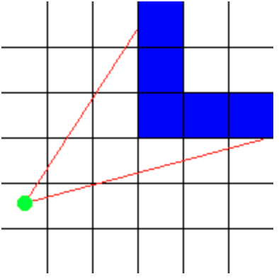

## 06_CUB3D

### How to use Makefile

    make maps/map_name.cub
    
### How to make screenshot

    make maps/map_name.cub --save

* Before starting this project : http://users.atw.hu/wolf3d

|NAME|CONTENTS|
|:--|:---|
|Program name|cub3D|
|Turn in files|All your files|
|Makefile|all, clean, fclean, re, bonus|
|External functs.|open, close, read, write, malloc, free, perror, strerror, exit All functions of the math library (-lm man man 3 math) All functions of the MinilibX|
|Libft authorized|Yes|
|Description|You must create a realistic 3D graphical representation of the inside of a maze from a first person perspective. you have to create this representation using the Ray-Casting principles mentioned earlier.|

* This project is inspired by the world-famous eponymous 90's game, which was the first FPS ever. It will enable you to explore ray-casting.

### FPS (Frame Per Second)

    초당 프레임을 말한다.
    
    정지 사진 하나를 프레임이라 하고, 이런 사진 토막이 1초에 보이는 속도를 Frame Rate라고 한다.
    
    프레임률이라고도 하며, 단위로 fps를 사용한다.

### Ray-casting

    광선 투사로, 광선과 표면의 교차검사를 사용하는 기법을 말한다.
    
    광선 투사는 2D 지도에서 3D 관점을 만드는 렌더링 기술이다.
    
    
    
    특정한 방향으로 광선을 쏘아 장애물을 만나는 지 확인하고 장애물까지의 거리를 구할 수 있다.
    
    플레이어의 시야를 60도로 정하고, 방향벡터를 이용하여 각도에 따른 장애물과 플레이어의 거리를 구한다.
    
    구한 거리를 이용하여 화면에 나타날 이미지의 길이를 결정할 수 있다.
    
    reference : https://lodev.org/cgtutor/raycasting.html
