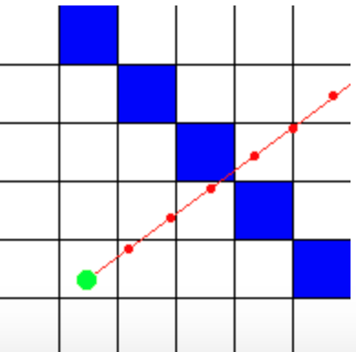
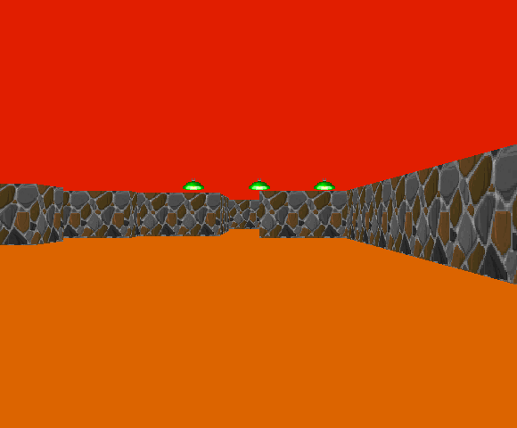

## 06_CUB3D

### How to use Makefile

    make maps/map_name.cub
    
### How to make screenshot

    make maps/map_name.cub --save

### gcc flags

    BFLAGS : -Wall -Wextra -Werror
    
    CFLAGS : -L./mlx_opengl -lmlx -framework OpenGL -framework AppKit
    
    DFLAGS : -D BUFFER_SIZE=1024
    
    EFLAGS : -L./utils -lutils
    
    Memory leaks : -g3 -fsanitize=address

### Mandatory part

* Before starting this project : http://users.atw.hu/wolf3d

|NAME|CONTENTS|
|:--|:---|
|Program name|cub3D|
|Turn in files|All your files|
|Makefile|all, clean, fclean, re, bonus|
|External functs.|open, close, read, write, malloc, free, perror, strerror, exit All functions of the math library (-lm man man 3 math) All functions of the MinilibX|
|Libft authorized|Yes|
|Description|You must create a realistic 3D graphical representation of the inside of a maze from a first person perspective. you have to create this representation using the Ray-Casting principles mentioned earlier.|

* This project is inspired by the world-famous eponymous 90's game, which was the first FPS ever. It will enable you to explore ray-casting.

### FPS (Frame Per Second)

    초당 프레임을 말한다.
    
    정지 사진 하나를 프레임이라 하고, 이런 사진 토막이 1초에 보이는 속도를 Frame Rate라고 한다.
    
    프레임률이라고도 하며, 단위로 fps를 사용한다.

### Ray-casting

    광선 투사로, 광선과 표면의 교차검사를 사용하는 기법을 말한다.
    
    광선 투사는 2D 지도에서 3D 관점을 만드는 렌더링 기술이다.
    
    
    
    특정한 방향으로 광선을 쏘아 장애물을 만나는 지 확인하고 장애물까지의 거리를 구할 수 있다.
    
    플레이어의 시야를 60도로 정하고, 방향벡터를 이용하여 각도에 따른 장애물과 플레이어의 거리를 구한다.
    
    구한 거리를 이용하여 화면에 나타날 이미지의 길이를 결정할 수 있다.
    
   reference : https://lodev.org/cgtutor/raycasting.html

### Minilibx

   * minilibx : an easy way to create graphical software.
    
    mlx_init() : create void pointer mlx
    
    mlx_new_window(void *mlx, int width, int height, char *name) : create a new window on the screen, using width, height parameters to determine its size, and name as the text that should be displayed in the window's title bar.

    mlx_clear_window(void *mlx, void *win) : clear the given window.
    
    mlx_destroy_window(void *mlx, void *win) : destroy the given window.

    mlx_new_image(void *mlx, int width, int height) : create a new image in memory.
    
    mlx_put_image_to_window(void *mlx, void *win, void *img, int x, int y) : draw image and dump the image inside a window. x, y coordinates define where the image should be placed in the window.
    
    mlx_get_data_addr(void *img, int *pixel, int *size, int *endian) : it returns information about the created image, allowing a user to modify it later. pixel will be filled with the number of bits needed to represent a pixel color. size is the number of bytes used to store one line of the image in memory. endian tells you wether the pixel color in the pixel color in the image needs to be stored in (little, 0) or (big, 1).

    mlx_xpm_file_to_image(void *mlx, char *file, int *width, int *height): create a new image. minilibX does not use the standard xpm library to deal with xpm images.

    mlx_destroy_image(void *mlx, void *img) : destroys the given image.

    mlx_hook() : on key and mouse events, additional information is passed. keycode tells you which key is pressed.
    
    mlx_loop_hook(void *mlx, int (*funct)(), void *param) : it is identical to the previous ones, but the given function will be called when no event occurs.

    mlx_loop(void *mlx) : To handle keyboard or mouse events, it must be used. it never returns. It is infinite loop that waits for an event, and then calls a user-defined function associated with this event.
    
   reference : https://github.com/qst0/ft_libgfx //minilibX tutorial

---
### 코드 구현 순서

#### XPM 파일

    지도에 사용되는 이미지 파일을 읽고 저장한다.
    
    가장 먼저 이미지 파일을 저장하는 이유는, 이후에 지도 파일에서 장애물, 벽의 이미지를 변경하기 위함이다.
    
    mlx_xpm_file_to_image() 함수를 이용하여 xpm 파일을 읽고, t_img 이미지 구조체에 저장한다.
    
    mlx_get_data_addr() 함수를 이용하여 t_img 구조체에 있는 이미지를 void 파일에 저장한다.
    
    이미지 색은 16진수로 int 포인터에 저장하면, 재사용하기에 편하므로 int 포인터에 저장한다.

#### 지도 파일

    지도 파일을 열기 전, ft_endwidth 함수를 이용하여 .cub 파일인지 확인한다.
    
    만약, 입력 받은 지도 파일이 존재하지 않는 경우, 오류 메세지를 출력하고 게임을 종료한다.
    
    R : resolution
    
    F : floor color (hexa)
    
    C : ceil color (hexa)
    
    EA : east wall color (hexa)
    
    WE : west wall color (hexa)
    
    SO : south wall color (hexa)
    
    NO : north wall color (hexa)
    
    R flag는 스크린의 크기를 결정하며, 지도 파일 내에 R flag가 없는 경우, 기본 설정된 값으로 스크린의 크기가 결정된다.
    
    만약, 입력받은 해상도의 크기가 사용 중인 컴퓨터 화면의 크기(mac book 13인치 기준)보다 크다면, 최대 크기로 결정된다.
    
    위의 EA, WE, SO, NO에 따른 벽의 색을 달리하기위해 texture 배열의 0, 1, 2, 3번째에 차례로 벽의 이미지를 저장한다.
    
    지도의 줄 수를 세어 max_row를 저장하고, 메모리를 할당한다.
    
    각 row에 따른 col의 수를 세어 메모리를 할당하고, 전역변수에 지도를 저장한다.
    
    지도 내에서 E, W, S, N은 플레이어가 바라보는 방향을 나타내고, 이애 따라 direction과 camera plane의 방향이 달라야한다.
    
    E, W, S, N : player's direction
    
    1 : external wall
    
    2, 4 : wall
    
    3 : pillar
    
    5 : wood sprite
    
    6 : light
    
    7 : star

#### 지도 유효성 검사

    지도가 벽으로 둘러싸여있는 유효한 지도인지를 확인하고, 유효한 지도인 경우, 게임을 실행하고, 아닌 경우, 게임을 종료한다.
    
##### DFS (Depth-first Search, 깊이 우선 탐색)
   
    루트 노드에서 시작해서 다음 분기로 넘어가기 전에 해당 분기를 완벽하게 탐색하는 방법이다.
    
    모든 노드를 방문하고자 하는 경우에 이 방법을 사용한다.
    
    dfs 예제 : https://gmlwjd9405.github.io/2018/08/14/algorithm-dfs.html
    
    연결리스트로 주변 노드를 연결하고, 시작노드를 저장한다.
    
    시작점에서부터 이동 가능한 모든 노드를 방문하면서 도착점에 도달할 수 있는 길을 찾고,
    
    가능하다면 1을 반환하여 게임을 실행하고, 길이 없다면 0을 반환하여 게임을 종료한다.

#### 장애물(Sprite)

    지도 파일을 열어 장애물에 해당하는 번호의 갯수를 확인하고, 갯수에 따른 sprite 구조체의 메모리를 할당한다.
    
    할당한 메모리에 장애물의 위치 정보와 해당 번호를 저장한다.
    
    이때, 1에 해당하는 벽인 EA, WE, SO, NO가 0 ~ 3번까지이므로 이후의 모든 번호에 대한 이미지는 2씩 더해야한다.
    
    또한, 장애물의 이미지를 변수에 저장한 뒤, 해당 장애물 위치의 지도 값을 0으로 변경한다.
    
    이는 지도를 먼저 그린 뒤, 장애물을 그리기위해서이다.
        
#### key

    입력 받은 키에 따라 플레이어를 이동시킬 수 있다.
    
    W, UP arrow : move forward (x += dirx, y += diry)
    
    S, DOWN arrow : move backward (x -= dirx, y-= diry)
    
    A          : move left (x -= diry, y += dirx)
    
    D          : move right (x += diry, y -= dirx)
    
    LEFT arrow : rotate left side (rotation array)
    
    RIGHT arrow : rotate right side (rotation array)
    
    
#### ray-casting

    플레이어의 시야를 60도로 정하고, 방향벡터를 이용하여 각도에 따른 장애물과 플레이어의 거리를 구한다.

    플레이어를 기준으로 벽이나 장애물까지의 거리를 구하여 화면에 표시할 그림의 길이를 구할 수 있다.
    
    구한 거리를 이용하여 화면에 나타날 이미지의 시작점과 끝점을 구하여 저장한다.
    
    0 ~ 시작점까지는 천장의 색이 표현되고, 끝점 ~ screenheight까지는 바닥의 색이 표현된다.
    
    천장과 바닥도 이미지로 표현할 수 있고, 이는 추가적인 계산을 위한 함수가 필요하다.
    
#### coloring Sprite

    플레이어의 위치를 기준으로 장애물까지의 거리를 구한 뒤, 거리가 먼 순으로 배열을 정리한다.
    
    장애물의 거리가 먼 순으로 그림을 표현하여 같은 직선에 장애물이 여러 개이더라도 순서대로 그려지도록 한다.
    
---

### Screenshot

    입력 값에 "--save" flag가 있는 경우(ex> ./cub3D maps/1.cub --save),
    
    게임의 첫 화면을 bmp 파일로 저장한 뒤, 게임을 종료한다.
    
    bmp 파일의 구조에 맞춰 이미지 색상을 저장하여 파일을 만들어야 한다.

  
       
---

### 오류 처리

    입력 받은 가변인자의 갯수가 0개 또는 3개 이상일 때, INPUT ERROR! 출력한 뒤, 게임을 종료한다. (ex> ./cub3D , ./cub3D a b c)
    
    입력 받은 가변인자의 갯수가 2개이나 2번째 인자가 --save 가 아닌 경우, INPUT ERROR! 출력한 뒤, 게임을 종료한다. (ex> ./cub3D maps/1.cub -skeif)
    
    지도 파일이 .cub 파일이 아닌 경우, MAP ERROR 출력한 뒤, 게임을 종료한다. (ex> ./cub3D maps.txt)
    
    지도 파일이 없는 경우, 파일을 열 수 없는 경우이므로 FAIL TO PARSE MAP 출력한 뒤, 게임을 종료한다. (ex> ./cub3D 4map.cub)
    
    메모리 할당을 하지 못하는 오류가 발생한 경우, FAIL TO ALLOCATE SPACES 출력한 뒤, 게임을 종료한다.
    
    xpm 파일을 저장하는 과정에서 오류가 발생한 경우, FAIL TO READ XPM. 출력한 뒤, 게임을 종료한다.
    
---

### REVIEW CHECK POINT!

   * 입력 오류 확인! - ./cub3D , ./cub3D maps/1.cub , ./cub3D maps/1.cub --save , ./cub3D maps/non.cub , ...
   * "--save" flag 있는 경우, screenshot.bmp 파일을 만든 뒤, 게임을 종료해야 한다.
   * R key 확인! - R 이 있는 경우, 값이 화면보다 큰 경우, 값이 없는 경우
   * 지도 유효성 검사 - 벽이 둘러싸여 있지 않은 경우
   * Memory leaks 확인! - -g3 -fsanitize=address / leaks / top
   
