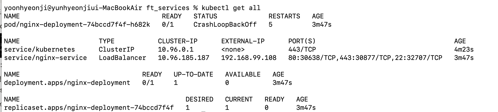
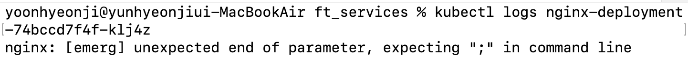

## CrashLoopBackoff

yaml 파일을 작성하여 deployment를 생성했다.

그런데, pod가 제대로 생성되지 않고, Error 발생하고, CrashLoopBackoff이 반복적으로 발생했다.

### kubectl describe pod [pod-name]

위의 명령어를 이용하여 pod의 상태를 디테일하게 확인할 수 있다.

### kubectl logs [pod-fullname]

위의 명령어를 이용하여 pod의 로그를 확인할 수 있다.

그림에서 알 수 있듯이, ';' 세미콜론이 빠졌다는 오류를 확인할 수 있었다.

세미콜론을 넣어야 하는 부분을 고민하던 중, Dockerfile의 마지막에서 ENTRYPOINT 명령어로 nginx을 실행하는 부분을 떠올렸다.

ENTRYPOINT ["nginx", "-g", "daemon off"]

위의 명령어로 nginx를 실행할 때, 세미콜론을 넣어야하나? 생각이 들어 수정했다.

ENTRYPOINT ["nginx", "-g", "daemon off;"]

위와 같이 명령어를 수정하자, pod가 정상적으로 작동되었다.
