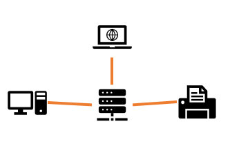

NETWORK

1. Network Fundamentals
  
    - [x] 네트워크란?
        
        컴퓨터, 프린트, 티비의 기계들을 네트워크로 연결한다. 연결된 네트워크를 이용하여 기계들은 정보를 공유할 수 있다. 이는 인터넷을 연결하는 데에 사용된다.
        케이블을 기계에 연결하여 다른 기계로 연결한는 것을 'switch'라고 한다.
        
        
