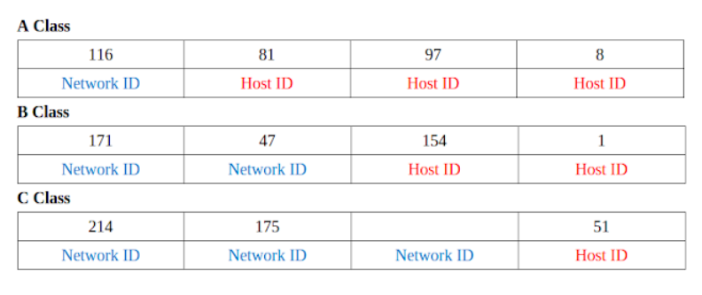
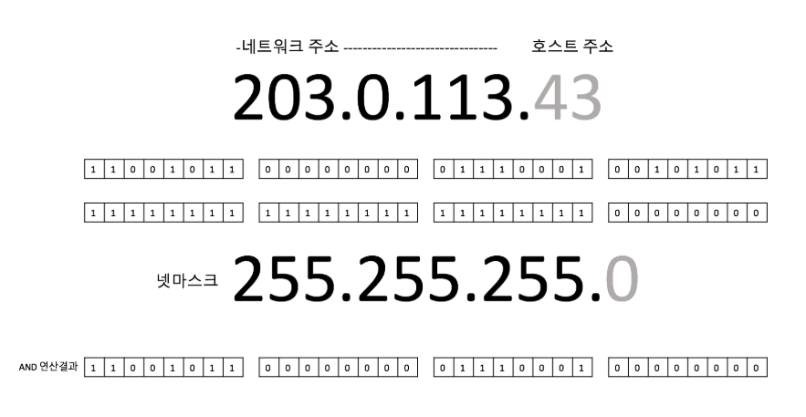
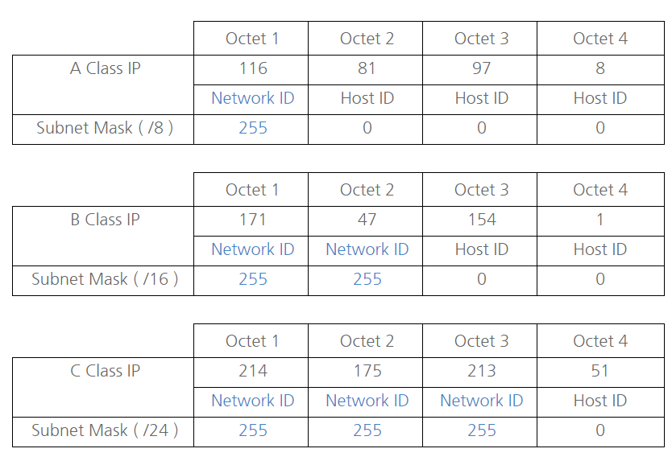

**NETWHAT**

1. WHAT IS IP ADDRESS?
  
    IP 주소는 컴퓨터 네트워크에서 장치들이 서로를 인식하고 통신을 하기 위해서 사용하는 특수한 번호이다.
    
    IP 주소에는 IPv4, IPv6가 있고, IPv4는 32비트로 0 ~ 255 사이의 십진수로 네자리를 사용하고, 점으로 구분하여 나타낸다.
    (ex) 255.255.255.255, 127.0.0.1(localhost))
  
    IPv6는 128비트로 16진수 8개를 사용하여 :(콜론)으로 구분한다. 
    
    IP 주소는 논리적인 주소체계이고, 물리적인 주소체계에는 MAC(media access control)주소가 있다. 물리적 주소체계는 LAN, Ethernet의 망에서 통신을 하기 위하여 사용된다.
    
    MAC은 자신이 속한 네트워크 안에서만 통신이 되는 데, 이후 네트워크를 빠져나가는 장치인 router를 지나면 IP를 이용하여 통신한다.
    
    IP 주소에는 network ID와 host ID가 있다. network ID는 네트워크의 범위를 지정하여 관리하기 쉽게 만들어 낸 것이고, host ID는 호스트를 개별적으로 관리하기 위해 사용하는 것이다.
    
    IP 주소의 클래스는 네트워크의 규모에 따라 결정되는 데, A ~ E Class로 나누어져 있다. 네트워크 주소 영역과 호스트 주소 영역의 차이가 있다.
    
    
    
    A Class는 처음 8비트가 네트워크 아이디이며 나머지 24비트가 호스트 아이디로 사용된다. 비트가 0으로 시작하기 때문에 네트워크 할당은 0 ~ 127이다. 
    
    B Class는 처음 16비트가 네트워크 아이디이고, 나머지 16비트가 호스트 아이디로 사용된다.
    비트가 10으로 시작하므로 네트워크 할당은 16 - 2 비트인, 2^14개다.
    
    C Class는 처음 24비트가 네트워크 아이디이고, 나머지 8비트가 호스트 아이디로 사용된다.
    비트가 110으로 시작하므로 네트워크 할당은 24 - 3 비트인 2^21개다.
    
    D Class는 Multicast, E Class는 미래에 사용하기 위해 남겨둔 것이다. 실제로 사용되는 경우가 거의 없다.
    
    각 클래스는 첫 번째 옥텟(Octet)으로 구분할 수 있다. 
    A Class는 0으로 시작하므로 0 ~ 127로 시작하고, B Class는 10으로 시작하므로 128 ~ 이며, C Class는 110으로 시작하므로 192 ~, D는 224, E는 240이다.
    
2.  WHAT IS NETMASK?

    넷마스크는 32비트로 흔히 설정하는 255.255.255.0을 의미한다. 
   
    라우터를 거치지 않고도 통신이 가능한 영역을 네트워크라고 하고, 
    네트워크 주소 부분의 비트를 1로 치환한 것이 그 네트워크의 넷마스크이다.
    
    IP 주소와 넷마스크를 AND연산하면 네트워크 주소를 얻을 수 있다. 
    
    
    
3. WHAT IS THE SUBNET OF AN IP WITH NETMASK?
    
    IP 주소의 부족현상을 해결하기 위해 서브넷을 사용한다.
    
    넷마스크를 이용하여 네트워크를 나누는 것을 서브넷팅(subnetting)이라고 한다. 반대로 네트워크를 합치는 것을 슈퍼넷팅(supernetting)이라고 한다.
    
    서브넷 마스크는 IP 주소 체계의 network ID 와 host ID를 넷 마스크를 통해 변경하여 네트워크 영역을 분리시키는 개념이다.
    
    서브넷팅은 호스트 아이디를 네트워크 아이디로 변환하게 되고,
    
    슈퍼넷팅은 네트워크 아이디를 호스트 아이디로 변환하게 된다.
    
    서브넷 마스크와 IP 주소의 형태가 같은 이유는 AND연산을 하기 위해서이다.
    
    
    
    IP 주소 뒤에 /24 와 같은 수는 접두어로 서브넷 마스크의 비트수를 의미한다.
    
    * 서브넷팅으로 네트워크가 분리되므로 서로가 통신하기 위해서는 라우터를 통해서만 가능하고, 같은 네트워크에 속해 있는 호스트들은 같은 영역에 존재하므로 라우터를 거치지 않고 통신할 수 있다.
    
    * 특정한 호스트에서 많은 트래픽을 발생시켜 속도를 저하시키는 문제를 해결하는 데에 용이하다.
    
    * CIDR(Classless Inter-Domain Routing, 사이더)는 클래스가 없는 도메인 간 라우팅 기법으로 최신 IP 주소 할당 방법이다. IP 주소 뒤에 /로 구분하고 서브넷마스크의 비트수를 적어 표시하는 것을 CIDR 표기법이라 부른다.
