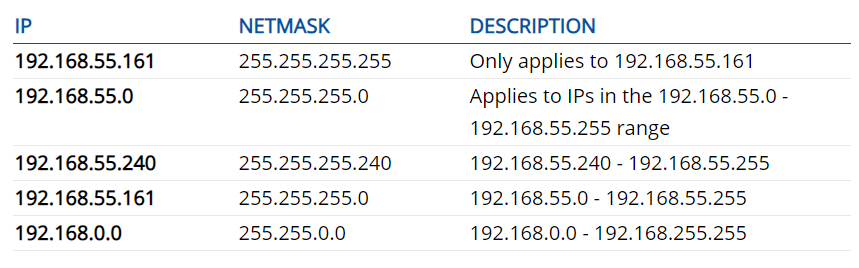
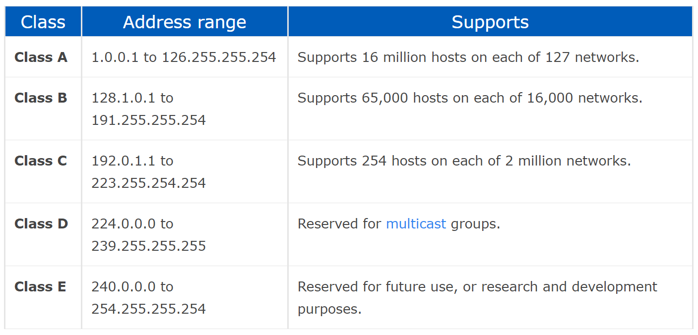
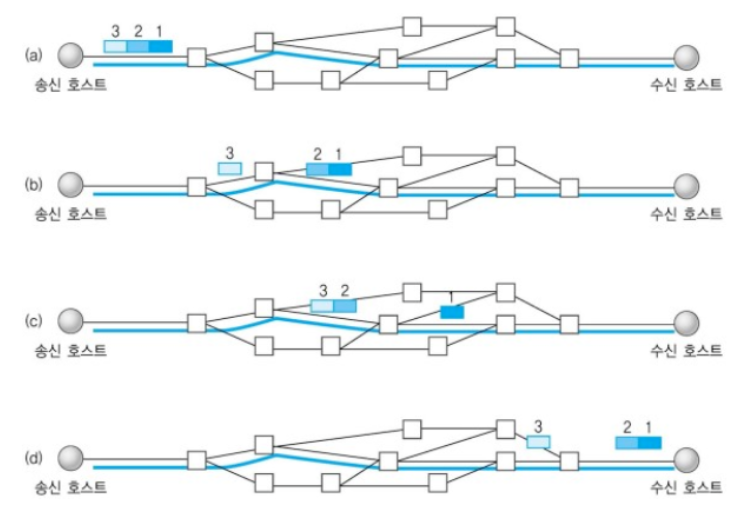
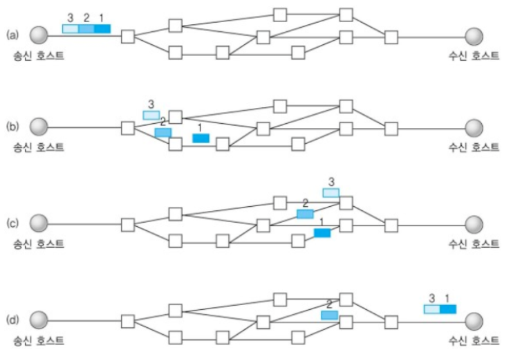
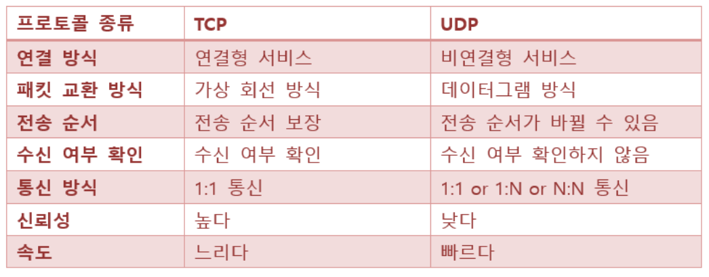

**NETWHAT**

1. WHAT IS IP ADDRESS?
  
    IP 주소는 컴퓨터 네트워크에서 장치들이 서로를 인식하고 통신을 하기 위해서 사용하는 특수한 번호이다.
    
    IP 주소에는 IPv4, IPv6가 있고, IPv4는 32비트로 0 ~ 255 사이의 십진수로 네자리를 사용하고, 점으로 구분하여 나타낸다.
    (ex) 255.255.255.255, 127.0.0.1(localhost))
  
    IPv6는 128비트로 16진수 8개를 사용하여 :(콜론)으로 구분한다. 
    
    IP 주소는 논리적인 주소체계이고, 물리적인 주소체계에는 MAC(media access control)주소가 있다. 물리적 주소체계는 LAN, Ethernet의 망에서 통신을 하기 위하여 사용된다.
    
    MAC은 자신이 속한 네트워크 안에서만 통신이 되는 데, 이후 네트워크를 빠져나가는 장치인 router를 지나면 IP를 이용하여 통신한다.
    
    IP 주소에는 network ID와 host ID가 있다. network ID는 네트워크의 범위를 지정하여 관리하기 쉽게 만들어 낸 것이고, host ID는 호스트를 개별적으로 관리하기 위해 사용하는 것이다.
    
    IP 주소의 클래스는 네트워크의 규모에 따라 결정되는 데, A ~ E Class로 나누어져 있다. 네트워크 주소 영역과 호스트 주소 영역의 차이가 있다.
    
    
    
    A Class는 처음 8비트가 네트워크 아이디이며 나머지 24비트가 호스트 아이디로 사용된다. 비트가 0으로 시작하기 때문에 네트워크 할당은 0 ~ 127이다. 
    
    B Class는 처음 16비트가 네트워크 아이디이고, 나머지 16비트가 호스트 아이디로 사용된다.
    비트가 10으로 시작하므로 네트워크 할당은 16 - 2 비트인, 2^14개다.
    
    C Class는 처음 24비트가 네트워크 아이디이고, 나머지 8비트가 호스트 아이디로 사용된다.
    비트가 110으로 시작하므로 네트워크 할당은 24 - 3 비트인 2^21개다.
    
    D Class는 Multicast, E Class는 미래에 사용하기 위해 남겨둔 것이다. 실제로 사용되는 경우가 거의 없다.
    
    각 클래스는 첫 번째 옥텟(Octet)으로 구분할 수 있다. 
    A Class는 0으로 시작하므로 0 ~ 127로 시작하고, B Class는 10으로 시작하므로 128 ~ 이며, C Class는 110으로 시작하므로 192 ~, D는 224, E는 240이다.
    
2.  WHAT IS NETMASK?

    넷마스크는 32비트로 흔히 설정하는 255.255.255.0을 의미한다. 
   
    라우터를 거치지 않고도 통신이 가능한 영역을 네트워크라고 하고, 
    네트워크 주소 부분의 비트를 1로 치환한 것이 그 네트워크의 넷마스크이다.
    
    IP 주소와 넷마스크를 AND연산하면 네트워크 주소를 얻을 수 있다. 
    
    
    
3. WHAT IS THE SUBNET OF AN IP WITH NETMASK?
    
    IP 주소의 부족현상을 해결하기 위해 서브넷을 사용한다.
    
    넷마스크를 이용하여 네트워크를 나누는 것을 서브넷팅(subnetting)이라고 한다. 반대로 네트워크를 합치는 것을 슈퍼넷팅(supernetting)이라고 한다.
    
    서브넷 마스크는 IP 주소 체계의 network ID 와 host ID를 넷 마스크를 통해 변경하여 네트워크 영역을 분리시키는 개념이다.
    
    서브넷팅은 호스트 아이디를 네트워크 아이디로 변환하게 되고,
    
    슈퍼넷팅은 네트워크 아이디를 호스트 아이디로 변환하게 된다.
    
    서브넷 마스크와 IP 주소의 형태가 같은 이유는 AND연산을 하기 위해서이다.
    
    
    
    IP 주소 뒤에 /24 와 같은 수는 접두어로 서브넷 마스크의 비트수를 의미한다.
    
    * 서브넷팅으로 네트워크가 분리되므로 서로가 통신하기 위해서는 라우터를 통해서만 가능하고, 같은 네트워크에 속해 있는 호스트들은 같은 영역에 존재하므로 라우터를 거치지 않고 통신할 수 있다.
    
    * 특정한 호스트에서 많은 트래픽을 발생시켜 속도를 저하시키는 문제를 해결하는 데에 용이하다.
    
    * CIDR(Classless Inter-Domain Routing, 사이더)는 클래스가 없는 도메인 간 라우팅 기법으로 최신 IP 주소 할당 방법이다. IP 주소 뒤에 /로 구분하고 서브넷마스크의 비트수를 적어 표시하는 것을 CIDR 표기법이라 부른다.

4. WHAT IS THE BROADCAST ADDRESS OF A SUBNET?

    - [x] Broadcast
        
        * 라디오 네트워크를 통해 전달되는 소리나 영상
        
        * 컴퓨터 네트워크에서 broadcasting은 모든 네트워크 사용자에게 답신 없이 메세지를 전송하는 것을 말한다.
        
        특정한 호트스로 패킷을 전홍하는 것이 아니라 특정 네트워크 전체에 패킷을 전송할 때 사용하는 IP Address가 broadcast IP이다.
        
        Broadcast IP address는 255.255.255.255를 사용하거나 IP address의 subnet 부분을 제외한 호스트 자리를 2진수 1로 채운 것이다. 
        
        예를 들자면, 10.1.10.100이라는 IP address를 가지는 호스트가 255.255.255.0이라는 subnet mask를 사용한다면, 이 subnet의 broadcast IP는 10.1.10.255가 된다.
        
        이런 broadcast는 네트웍을 관리하는 특정 목적의 protocol과 UDP를 사용한 통신에서만 사용이 가능하다.
        
5. WHAT IS THE DIFFERENT WAYS TO REPRESENT AN IP ADDRESS WITH THE NETMASK?
        
    - [x] Netmask
    
        32비트의 마스크로 IP 주소를 서브넷으로 나누는 데에 사용된다. 그리고 네트워크의 가능한 호스트 주소를 명시한다.
        
        넷마스크는 네크워크의 크기를 정의하거나 네트워크의 범위나 영역을 의미한다.
        
        만약, IP 주소가 192.168.55.162일 때, netmask가 255.255.255.255라면 IP주소가 192.168.55.162에만 적용된다. 그러나 netmask가 255.255.255.0이라면 IP주소가 192.168.55.0 부터 192.168.55.255까지의 주소에 적용된다.
        
        만약, netmask가 255.255.255.240이면, IP주소는 192.168.55.240부터 192.168.55.255까지 적용된다.
        
        
        
6. WHAT ARE THE DIFFERENCES BETWEEN PUBLIC AND PRIVATE IPs?

    - [x] Public IP address
        
        Public IP 주소는 인터넷을 직접적으로 허용하도록 기계에 할당하는 주소이다. 웹 서버, 이메일 서버와 인터넷에 바로 연결할 수 있는 서버들이 public IP 주소를 사용할 수 있다. Public IP 주소는 전세계적으로 특별하고, 특정한 기계에서만 사용할 수 있다.
        
    - [x] Private IP address
        Private IP 주소는 개인적인 네트워크를 만들어 사용하는 interNIC으로 할당되는 주소 공간이다. 개인적으로 사용하는 IP blocks는 A, B, C Class가 있다. 
        
        컴퓨터에 private IP 주소가 할당되면, local devices들이 IP 주소로 컴퓨터를 볼 수 있다. 그러나 local 네트워크 밖에 있는 기계들은 개인 IP 주소를 사용할 수 없다. 개인 IP 주소에 직접적으로 연결을 하려면 NAT(Network Address Translator)를 사용해야 한다.       

7. WHAT IS A CLASS OF IP ADDRESSES?

    - [x] IP address classes
        
        
        
        IPv4 IP 주소에는 5가지 클래스가 있다.
        
        A Class는 처음 8비트가 네트워크 아이디이며 나머지 24비트가 호스트 아이디로 사용된다. 비트가 0으로 시작하기 때문에 네트워크 할당은 0 ~ 127이다. 
    
        B Class는 처음 16비트가 네트워크 아이디이고, 나머지 16비트가 호스트 아이디로 사용된다.
    비트가 10으로 시작하므로 네트워크 할당은 16 - 2 비트인, 2^14개다.
    
        C Class는 처음 24비트가 네트워크 아이디이고, 나머지 8비트가 호스트 아이디로 사용된다.
    비트가 110으로 시작하므로 네트워크 할당은 24 - 3 비트인 2^21개다.
    
        D Class는 Multicast, E Class는 미래에 사용하기 위해 남겨둔 것이다. 실제로 사용되는 경우가 거의 없다.
        
8. WHAT IS TCP?

    - [x] TCP (Transmission Control Protocol, 전송 제어 프로토콜)
        
        근거리 통신망이나 인트라넷, 인터넷에 연결된 컴퓨터에서 실행되는 프로그램 간에 일련의 옥텟을 안정적으로, 순서대로, 에러없이 교환할 수 있게 한다.
        
        인터넷상에서 데이터를 메세지의 형태로 보내기 위해 IP와 함께 사용하는 프로토콜이고, 네트워크의 정보 전달을 통제하는 프로토콜이자 인터넷을 이루는 핵심 프로토콜의 하나이다.
        
        일반적으로 TCP 와 IP를 함께 사용하는데, IP가 데이터 전달을 한다면, TCP는 패킷을 추적 및 관리하게 된다.
        
        데이터는 패킷 단위로 나누어 목적지로 전송된다. 분리된 패킷에 번호를 부여하여 패킷의 분실 확인과 같은 처리를 하고, 목적지에서 재조립하는 방식이다.
        
        TCP의 안정성을 필요로 하지 않는 애플리케이션의 경우 일반적으로 비접속형 사용자 데이터그램 프로토콜(User Datagram Protocol, UDP)을 사용한다. UDP는 전달 확인 및 순차 보장 기능이 없는 대신 오버헤드가 작고 지연시간이 짧다.
        
        
        
        * TCP는 연결형 서비스로 가상 회선 방식을 제공한다. 발신지와 수신지를 연결하여 패킷을 전송하기 위한 논리적 경로를 배정한다.
        * 3-way handshaking 과정(목적지와 수신지를 확실히하여 정확한 전송을 보장하기 위해 세션을 수립하는 과정을 의미한다.)을 통해 연결을 설정하고, 4-way handshaking을 통해 해제한다. 
        * 흐름 제어 및 혼잡 제어
        * 높은 신뢰성을 보장한다. (연속성보다 신뢰성있는 전송)
        * UDP 보다 속도가 느리다. (CPU를 사용하기 때문에 속도가 느리다.)
        * 전이중(Full-Duplex), 점대점(Point to Point) 방식
        
        TCP 서버의 특징
          
          * 서버 소켓은 연결만을 담당한다.
          * 연결과정에서 반환된 클라이언트 소켓은 데이터 송수신에 사용된다.
          * 서버와 클라이언트는 1대 1로 연결된다.
          * 스트림 전송으로 전송 데이터의 크기가 무제한이다.
          * 패킷에 대한 응답을 해야하기 때문에 성능이 낮다. (시간 지연, CPU 소모)
          * 손실된 경우 재전송을 요청하므로 Streaming 서비스에 불리하다.
          cf) 패킷(Packet)이란?
          
              인터넷 내에서 데이터를 보내기 위한 경로배정(라우팅, routing)을 효율적으로 하기 위해서 데이터를 여러 개의 조각들로 나누어 전송을 하는 데, 이 조각들을 패킷이라고 한다.
          
9. WHAT IS UDP?          
    
    - [x] UDP(User Datagram Protocol, 사용자 데이터그램 프로토콜)
    
        데이터를 데이터그램 단위로 처리하는 프로토콜이다. 데이터그램이란 독립적인 관계를 지니는 패킷이라는 뜻이다.
        
        TCP와 달리 UDP는 비연결형 프로토콜이다. 즉, 연결에 할당되는 논리적인 경로가 없기 때문에 각각의 패킷은 다른 경로로 전송되고, 독립적인 관계를 지닌다.
        
        
        
        * 비연결형 서비스로 데이터그램 방식을 제공한다.
        * 정보를 주고 받을 때, 정보를 보내거나 받는다는 신호절차를 거치지 않는다.
        * UDP헤더의 Checksum 필드를 통해 최소한의 오류만 검출한다.
        * 신뢰성이 낮다.
        * TCP보다 속도가 빠르다.
        
        비연결형 서비스이기 때문에 연결을 설정하고 해제하는 과정이 존재하지 않는다. 서로 다른 경로로 전달되고 독립적으로 처리하지만, 순서를 부여하여 재조립하거나 흐름 제어, 혼잡 제어를 하지 않기 때문에 TCP보다 속도가 빠르다. 그러나 신뢰성이 낮다.
        
        연속성이 중요한 streaming 서비스에 자주 사용된다.
        
        UDP 서버의 특징
          
          * UDP에는 연결 자체가 없어 서버 소켓과 클라이언트 소켓의 구분이 없다.
          * 소켓 대신 IP를 기반으로 데이터를 전송한다.
          * 서버와 클라이언트는 1대 1, 1대 N, N대 M으로 연결 가능하다.
          * 데이터그램(메세지) 단위로 전송되며 그 크기는 65535 바이트로 크기가 초과하면 잘라서 보낸다.
          * 흐름제어가 없어 패킷이 제대로 전송되었는지, 오류가 있는지 확인할 수 없다.
          * 파일 전송과 같은 신뢰성보다는 성능이 중요시 되는 경우에 사용된다.
          cf) 흐름제어(flow control)는 데이터를 송신하는 곳과 수신하는 곳의 데이터 처리 속도를 조절하여 수신자의 버퍼 오버플로우를 방지하는 것이다.
          cf) 혼잡제어(congestion control)는 네트워크 내의 패킷 수가 넘치지 않도록 방지하는 것이다. 만약, 정보의 소통량이 과다하면 패킷을 조금만 전송하여 혼잡 붕괴 현상이 일어나는 것을 막는다.
          
        
        
10. 
