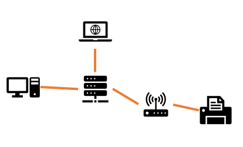

NETWORK

1. Network Fundamentals
  
    - [x] 네트워크란?
        
        컴퓨터, 프린트, 티비의 기계들을 네트워크로 연결한다. 연결된 네트워크를 이용하여 기계들은 정보를 공유할 수 있다. 이는 인터넷을 연결하는 데에 사용된다.
        
        케이블을 기계에 연결하여 다른 기계로 연결한는 것을 'switch'라고 한다.
        
        
        
        예를 들자면, 학교에 있는 컴퓨터들은 케이블로 벽에 있는 소켓에 연결된다. 벽의 소켓들은 하나의 patch panel로 모이고, 이를 switch에 연결된다. 
        
        집에서 사용하는 컴퓨터는 벽의 소켓에 연결되지 않고 대부분은 switch에 직접적으로 연결된다.
        
        선 연결없이 기계들을 연결할 수 있는데, wireless access point를 사용하고 이런 wireless network를 WI-FI라고 한다.
        
        
        
        여러 개의 기계들을 access point에 여러 번 연결할 수 있고, access point는 switch에 연결하는 역할을 한다.
        
        network의 목적은 특정 기계에서 다른 기계로 정보를 옮기는 데에 있다. 이를 위해, 보내는 사람과 받는 사람은 서로를 이해할 수 있게 같은 언어를 사용한다. 
        
        network에서 같은 언어를 사용한다는 것은 기계들이 정보를 어떻게 보내고, 받고, 다룰 것인지에 동의하는 것을 말하며 이를 'protocol'이라고 한다.
        
        프로토콜에는 자료를 주고 받는 데에 사용되는 Ethernet, TCP 등이 있고, web에 접근하는 데에 사용되는 HTTP, e-mail에 사용되는 SMTP가 있다.
    -----
    - [x] NETWORK TYPES
        
        노드는 switch나 router와 같이 네트워크로 지나가는 traffic을 관리하는 데에 도움을 준다.
       
        노드는 end points 나 hosts를 가지고 있다. end points와 hosts는 traffic 다발을 주고 받는 장치이다. 프린터, workstations, servers 등이 있다.
        
        서로 다른 크기로 작동하고 노드를 많이 사용하지 않는 것을 'soho network'이라고 한다. soho는 small office home office를 말하고, 여러 개의 핸드폰, 태블릿, 프린더, 컴퓨터를 가지고 있다.
        
        소호 네트워크에서 switch가 중심적인 허브 역할을 하기때문에 hub라고도 부른다.
        
        * 그러나, switch와 hub는 매우 다르다.
        
        hub는 아주 오래된 기술로 박물관을 제외하고는 보기 어렵다. 반면, switch는 현대적이고 주로 사용되고 있다.
        
        소호 네트워크에서, router는 인터넷을 연결하는 역할을 한다.
        
        router, switch, access point가 하나의 기계에 집합되어 있는 것을 볼 수 있다.
        
        은행과 같이 몇 개의 기계에 router, switch, access point가 있는 것을 'enterprise network'라고 한다. enterprise network는 건물의 여러 층의 네트워크를 커버할 수 있다. 또는, 여러 도시의 여러 빌딩이나 다른 나라까지도 커버할 수 있다.
        
        'service provider network'는 아주 큰 네트워크를 가지고 있는 것을 말하고, internet acceess 뿐만 아니라 소비자들을 연결해주는 서비스를 제공하기도 한다. 
        
        지역 범위의 네트워크를 'local area network' 또는 'LAN'이라고 하고, 소호 네트워크에서 랜은 기계를 연결하는 switch이다. 또는 랜은 enterprise network와 같이 큰 네트워크의 일부분이기도 하다. 필요에 따라 많은 switches, routers, access points를 가질수도 있다. 
        
        네트워크가 한 빌딩에만 있는 것이 아니라 전세계적으로 연결되는 것을 'WAN'이나 'wide area network'라고 한다. 
